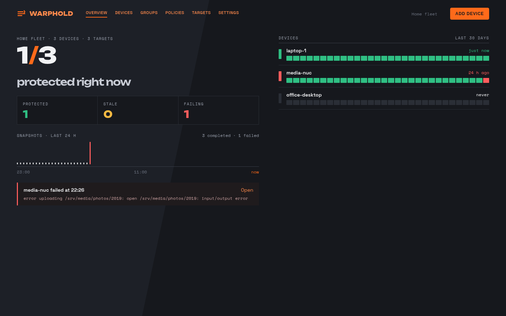
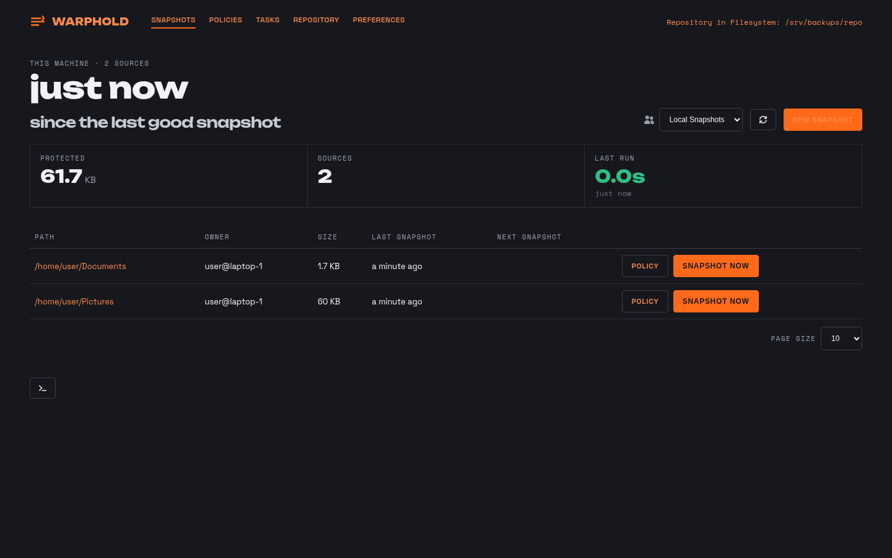

# warphold-ui

The WarpHold web UI: a React app, its built output committed under `build/`, and
a one-file Go module that embeds it. A fork of
[kopia/htmlui](https://github.com/kopia/htmlui) (Apache-2.0) — see
[LICENSE](LICENSE). This repository is the UI only; the server, the Fleet control
plane and the agent live in
[hodyhq/warphold](https://github.com/hodyhq/warphold).

## The Go module

`htmlui.go` is the whole of it: `//go:embed build`, and one exported function.

```go
package warpholdui

// AssetFile returns the built UI as an http.FileSystem.
func AssetFile() http.FileSystem
```

The server depends on `github.com/hodyhq/warphold-ui` and mounts what
`AssetFile()` returns. Consuming a new UI version is one command in the server
checkout:

```sh
go get github.com/hodyhq/warphold-ui@vX.Y.Z   # then commit go.mod + go.sum
```

Because the module serves `build/`, that directory is **committed on purpose**
(as upstream does with `kopia/htmluibuild`) — `go get` fetches source, not a
build step.

## Releasing a new UI version

```sh
scripts/release-build.sh          # npm ci && npm run build, then commits build/
git tag vX.Y.Z && git push origin vX.Y.Z # the tag IS the module version
```

Then bump the dependency in the server repo with the `go get` above. The script
refuses to run with anything already staged, and exits quietly when the build
output is unchanged. Tags are plain semver `vX.Y.Z`; there is no separate
release workflow, because a Go module needs nothing beyond the tag.

## Development

```sh
npm ci
npm run start      # vite dev server on the app, proxying /api to a local server
npm test           # vitest + coverage
npm run lint       # eslint
npm run prettier   # write; prettier:check in CI
```

The UI talks to a running WarpHold server. Start one from a sibling checkout of
[hodyhq/warphold](https://github.com/hodyhq/warphold) — `dev-start-server.sh` is
a starting point. The UI picks which product it renders (Fleet, single-machine
app, or agent page) from what the server answers; see `src/mode.ts`.

## Design system

Kinetic, under [`src/design/`](src/design):

- [`tokens.css`](src/design/tokens.css) — the palette and type scale as Tailwind
  v4 `@theme` tokens: ground `#16181D`, panel `#1D2027`, ink `#F2F3F5`, muted
  `#9AA0AD`, ember accent `#FF6A1A`, and health `#2FBF83` / `#F5B942` /
  `#FF5D5D`. Scoped to the `.wh` root class, and imported unlayered on purpose —
  the file's header comment explains why.
- [`fonts.css`](src/design/fonts.css) and `fonts/` — Unbounded (display), Space
  Grotesk (body) and Space Mono (data), self-hosted `woff2` with their OFL
  licenses alongside. No third-party font request is ever made.
- [`components/`](src/design/components) — the shared primitives every screen is
  built from: `Button`, `Card`, `Checkbox`, `Dialog`, `Eyebrow`, `Field`,
  `HealthBar`, `Input`, `Kpi`, `Nav`, `Pill`, `Select`, `Spinner`, `Strip`,
  `Table`, `Toast`, plus `tone.ts` for the health colour mapping. Import from
  `src/design/components`, and add to it rather than restyling in a page.

## Screenshots

`scripts/screenshots.sh` builds this checkout, stands up throwaway servers,
seeds them with invented demo data, and captures every screen at 1440 px and
412 px into `docs/screenshots/`. No browser-automation dependency is added — it
drives headless Chrome over CDP with the WebSocket already in Node (requires
Node.js 22.0.0+, where the global `WebSocket` is no longer experimental).

```sh
scripts/screenshots.sh                     # everything
scripts/screenshots.sh --only fleet-overview
```

Every screen with its caption: [`docs/screenshots/index.md`](docs/screenshots/index.md).
How the pipeline works, and what is in the demo data:
[`docs/screenshots/README.md`](docs/screenshots/README.md). Regenerate rather
than edit, and never hand-place a capture: `PLAN.json` is the contract both
drivers follow.





## Reporting issues

Bugs and feature requests for WarpHold — this UI included — go to
[hodyhq/warphold](https://github.com/hodyhq/warphold/issues). Security issues go
privately through
[GitHub Security Advisories](https://github.com/hodyhq/warphold/security/advisories/new),
not the issue tracker.
